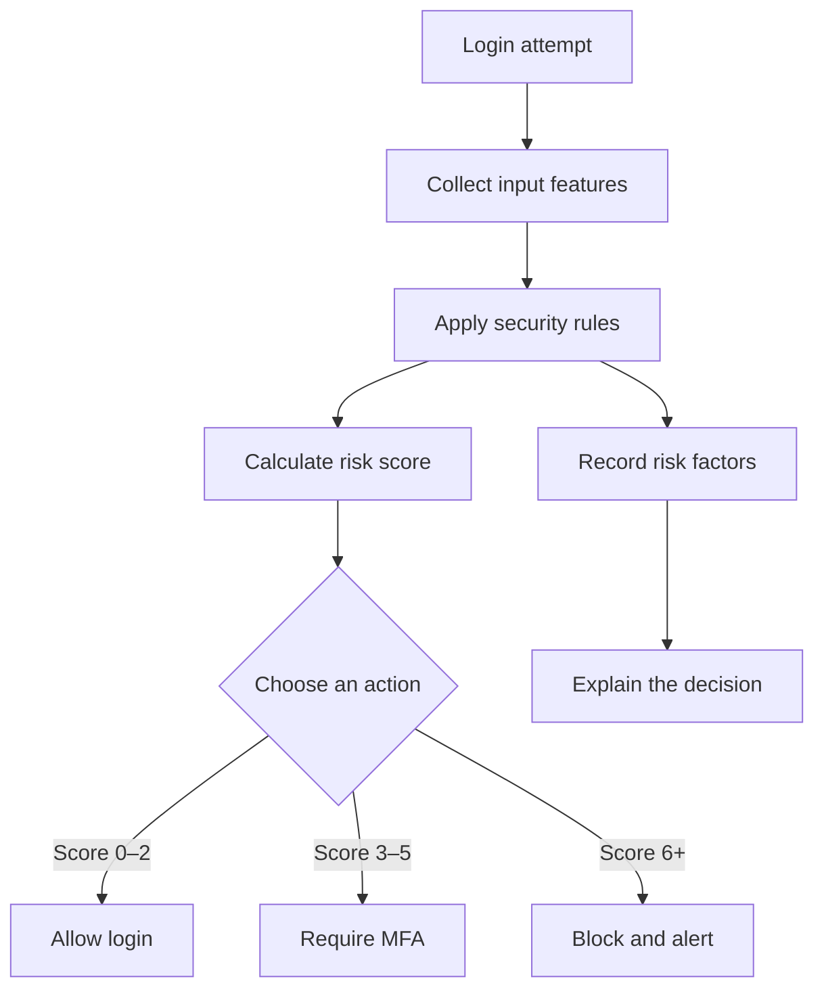
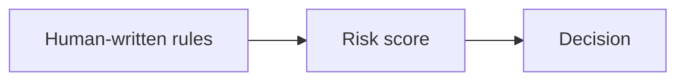
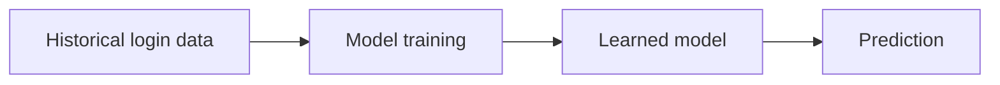

# Advanced AI Learning Journey

This repository documents my hands-on journey toward becoming an AI engineer. I am learning AI concepts from the foundation while strengthening my Python skills through small, practical projects.

## Day 1: Login Protection Agent

### What I was trying to achieve

I built a simple intelligent agent that evaluates a login attempt and chooses an appropriate security action.

The goal was to understand how an AI agent can:

1. Observe information from its environment.
2. Evaluate that information using knowledge and heuristics.
3. Make a rational decision.
4. Take an action toward a defined goal.
5. Explain why it made that decision.

## How the agent works

## Input features

The agent observes four pieces of information:

| Feature          | What it represents                            |
| ---------------- | --------------------------------------------- |
| Failed attempts  | Possible repeated unauthorized access         |
| Known device     | Whether the device has been recognized before |
| Unusual location | Whether the login location appears suspicious |
| Login time       | Whether the attempt occurred late at night    |

## AI concepts used

| AI concept     | How it appears in this project                  |
| -------------- | ----------------------------------------------- |
| Environment    | The authentication system                       |
| Perception     | Information collected about the login           |
| Features       | Attempts, device, location, and time            |
| Knowledge      | Human-defined security rules                    |
| Heuristic      | The point-based risk score                      |
| Rational agent | The program selects an action based on its goal |
| Goal           | Protect the account while allowing safe users   |
| Decision       | Allow, require MFA, or block                    |
| Action         | The authentication response                     |
| Explainability | The report lists the contributing risk factors  |

## Rule-based AI versus machine learning

This is a **rule-based AI agent**, not a machine-learning model.

The agent does not learn from historical data. I manually defined the rules and decision thresholds.

A future machine-learning version could learn risk patterns from labeled login records:

## Python concepts practiced

* Functions and parameters
* Conditional statements
* Loops
* Boolean values
* Lists and dictionaries
* Input validation
* Exception handling with `try/except`
* Separating input, decision logic, and output
* Python’s `__main__` entry point

## Main takeaway

This project helped me understand that an intelligent system does not always require machine learning. A system can behave like a basic rational agent by observing its environment, applying knowledge, selecting an appropriate action, and explaining its decision.

